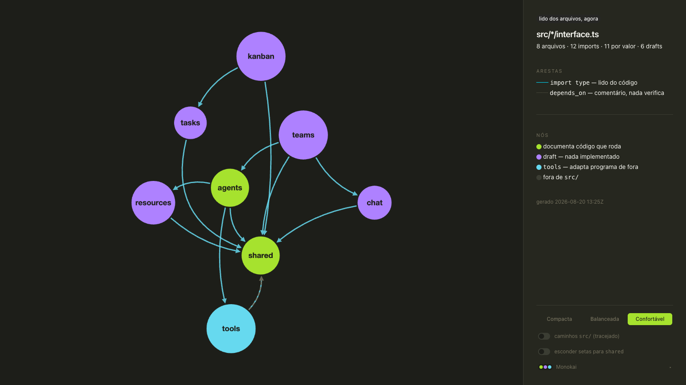

# my-graph

**Your architecture diagram is lying. The truth is in the code.**

[](https://github.com/biliboss/my-graph/actions/workflows/pages.yml)
[](LICENSE)



Draws what depends on what, read straight from the code.
**[See the five proofs — messy code looks messy, good code looks organized →](https://biliboss.github.io/my-graph/)**

Point it at a tree of systems, each one declaring its contract in
`<system>/interface.ts`, and it renders the dependency graph — every verb of every
interface one click away.

```bash
bun install
MY_GRAPH_ROOT=~/src/my/packages/interfaces bun run dev -- --port 4173
```

## What is actually in the picture

| ink | means |
|---|---|
| solid arrow | `import type` — read from the source |
| dashed arrow | `//! depends_on:` — a comment, and nothing verifies it |
| bright circle | a system that documents code that runs |
| pale circle | a draft: nothing implemented behind it yet |
| grey circle | a path cited from outside the tree, off by default |

The two arrow kinds are not decoration. An extractor that called both of them
"imports" was wrong about 22 of 26 edges here, and the picture looked right the
whole time — so the graph says where each edge came from, and stamps when it was
generated, because a stale picture should be detectable instead of arguable.

## Layout

Nodes are placed by [WebCola](https://ialab.it.monash.edu/webcola/), not by a
force layout. The difference is a guarantee: cola solves separation as VPSC
*constraints*, so `avoidOverlap` is a promise about bounding boxes, while
cose/fcose/d3-force merely push circles apart until the energy is low enough and
two can still land on top of each other.

Edges are routed afterwards, per edge, by bending a quadratic Bézier until no
sample of the **curve** falls inside a node it does not touch. Two things that
cost three wrong versions to learn, both written where they bite in
`ui/GraphCanvas.tsx`:

- measure the curve, not the chord — the straight line clears what the drawn arc
  does not;
- a quadratic reaches only **half** its control-point distance at the apex, so
  clearing a penetration of `d` costs `2d` of control distance.

The detour is capped. Without a ceiling, an edge that cannot get around anything
keeps pushing and the canvas fills with lassos.

## State lives in the URL

`#open=teams,agents&sel=kanban&d=compact` — back, forward and reload work for
free, and a link points at one reading of the graph.

## The family

| repo | job |
|---|---|
| [my](https://github.com/biliboss/my) | the local-first personal operating system this was born inside |
| **my-graph** | the X-ray: draws who depends on whom, read from the code |
| [my-company](https://github.com/biliboss/my-company) | the theory: the three processes every company depends on |
| [my-kanban](https://github.com/biliboss/my-kanban) | the board: one set of cards, every question |

MIT — [LICENSE](LICENSE).
